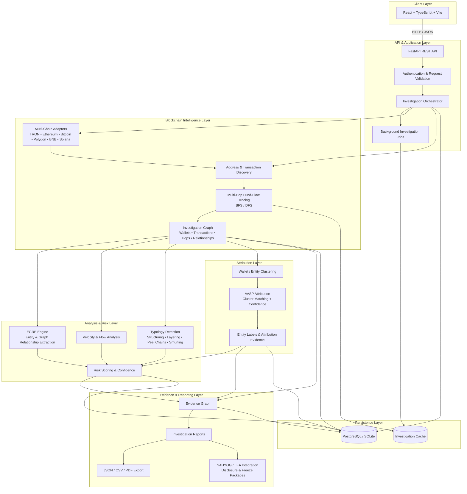

<div align="center">

# 🕵️‍♂️ SPECTER: See Beyond Blockchain

### Automated Multi-Chain Crypto Tracing & VASP Attribution Engine for Law Enforcement

[](https://www.sih.gov.in/)
[](https://specter-beige.vercel.app/)
[](https://fastapi.tiangolo.com/)
[](https://reactjs.org/)
[](https://www.postgresql.org/)
[](LICENSE)

**"From an Unknown Wallet to an Actionable VASP Notice"**<br>
Reconstructing multi-hop illicit fund trails, attributing destination VASPs with mathematical confidence scoring, and packaging court-admissible evidence for the **MHA I4C / SAHYOG Portal**.

[🌐 Live Prototype](https://specter-beige.vercel.app/) 

</div>

---

## 📌 Problem Statement (SIH26182)

* **Problem Statement ID:** `SIH26182`
* **Title:** Automated Attribution of Unknown Cryptocurrency Wallets to Nearest Virtual Asset Service Providers (VASPs) through Blockchain Intelligence APIs (SAHYOG Portal Integration)
* **Target Stakeholders:** Indian Cyber Crime Coordination Centre (I4C), Ministry of Home Affairs (MHA), State Cyber Crime Cells, Law Enforcement Agencies (LEAs), and Financial Regulators.
* **Team:** VeroAI *(Team ID: 146040)*

### The Core Operational Challenge

In financial cyber fraud (pig butchery, fake trading apps, ransomware, drug syndicates), victims deposit funds into an unhosted criminal wallet. The illicit money is rapidly fragmented through layers of intermediary wallets before being deposited into a centralized Virtual Asset Service Provider (VASP) for fiat off-ramping.

Manual tracking via public block explorers takes **hours or days per case**, requires dozen of open browser tabs, and fails to systematically differentiate between intermediary hops, bridge contracts, and deposit clusters. By the time a lawful disclosure request is manually filed, the funds have already been liquidated.


---

## 🏛️ System Architecture




---

🧩 Codebase Graph & Directory Structure

Specter/

├── app/

│   ├── api/

│   │   ├── endpoints/

│   │   │   ├── cases.py               # Case file management and lifecycle

│   │   │   ├── health.py              # System, DB, and blockchain provider health checks

│   │   │   ├── intelligence.py        # Entity and address classification queries

│   │   │   ├── investigation.py       # Async job runner & full case coordinator

│   │   │   ├── patterns.py            # Financial crime typology endpoints

│   │   │   ├── sahyog.py              # SAHYOG legal request & freeze package dispatch

│   │   │   ├── trace.py               # Multi-hop fund traversal endpoints

│   │   │   └── vasp.py                # VASP entity lookup & clustering queries

│   │   └── router.py                  # Consolidated FastAPI v1 router

│   ├── blockchain/

│   │   ├── adapters/

│   │   │   ├── base.py                # Abstract base blockchain connector

│   │   │   ├── bitcoin.py             # BTC adapter (UTXO co-spend & change heuristics)

│   │   │   ├── bnb.py                 # BNB Chain EVM adapter

│   │   │   ├── ethereum.py            # Ethereum ERC-20 & account transfer parser

│   │   │   ├── polygon.py             # Polygon POS adapter

│   │   │   ├── solana.py              # Solana SPL token & account parser

│   │   │   └── tron.py                # TRON TRC-20 (USDT) TronGrid adapter

│   │   └── registry.py                # Dynamic adapter resolver & factory

│   ├── core/

│   │   ├── config.py                  # Environment settings & API keys

│   │   ├── database.py                # SQLAlchemy ORM session factory

│   │   └── logging.py                 # Structured forensic logging

│   ├── evidence/

│   │   └── builder.py                 # Cryptographic chain of custody & evidence graph

│   ├── intelligence/

│   │   ├── classifier.py              # Address role classification (Deposit vs Hot vs Contract)

│   │   ├── cross_chain.py             # Cross-chain bridge & swap transition tracker

│   │   ├── mixer.py                   # Privacy mixer (Tornado Cash, etc.) interaction detector

│   │   └── risk_engine.py             # EGRE (Enhanced Graph Risk Engine)

│   ├── investigation/

│   │   └── orchestrator.py            # 5-stage automated investigation coordinator

│   ├── models/                        # SQLAlchemy database models

│   ├── reporting/

│   │   └── pdf_generator.py           # Automated Section 94 CrPC / BNSS forensic report generator

│   ├── sahyog/

│   │   └── adapter.py                 # Standardized MHA SAHYOG payload generator

│   └── main.py                        # FastAPI application entry point

├── frontend/                          # React + TypeScript Web Application

│   ├── src/

│   │   ├── components/                # Modular UI components (Graph, Inspector, Exports)

│   │   ├── services/                  # API client & mock datasets

│   │   ├── types/                     # TypeScript schema definitions

│   │   └── App.tsx                    # Master investigation dashboard

└── tests/                             # Comprehensive automated test suite


---

🎯 Key Differentiators

1. Evidence-Based VASP Attribution (No Overclaiming)

Commercial tools often guess or force an exchange name. SPECTER strictly adheres to an evidence-first rule:

* If evidence is strong (known deposit sweep heuristics + verified disclosure), it scores 100/100 (HIGH).
* If a path ends at an unhosted cold wallet or privacy protocol, it explicitly outputs No High-Confidence VASP Found.
* This eliminates false notices being served to exchanges, saving law enforcement crucial operational time.

2. Forensic Typology Detection (EGRE Engine)

The Enhanced Graph Risk Engine (EGRE) continuously evaluates fund dynamics along the traced path:

* Rapid Consolidation: Detecting victim fan-in transactions pooled into a single aggregator.
* Structuring / Smurfing: Identifying large amounts split into uniform sub-threshold amounts.
* Peel Chains: Identifying incremental peel-off transactions that keep forwarding primary value.
* Dormancy & Burst: Flagging addresses dormant for >180 days suddenly liquidating volume.

3. Native MHA SAHYOG & Legal Notice Integration

* Generates structured Section 94 CrPC / BNSS compliant legal notice packages.
* Formats transaction trails, cluster proofs, and target wallet identifiers into MHA SAHYOG-ready JSON/CSV schemas ready for direct inter-agency dispatch.

---

🔗 Supported Blockchains

| Network | Standard | Model | Implementation Status | Adapter Driver |
| :--- | :--- | :--- | :--- | :--- |
| **TRON** | TRC-20 (USDT) | Account | 🟢 **Live / Production** | TronGrid API / TronScan |
| **Ethereum** | ERC-20 / Native | Account | 🟡 **Implemented** | Etherscan v2 API |
| **Bitcoin** | Native BTC | UTXO | 🟡 **Implemented** | Blockstream / Mempool.space API |
| **Solana** | SPL Tokens | Account | 🟡 **Implemented** | Solana Web3 RPC |
| **Polygon** | ERC-20 / Native | Account | 🟡 **Implemented** | PolygonScan API |
| **BNB Chain** | BEP-20 / Native | Account | 🟡 **Implemented** | BscScan API |


---
## 🚀 Getting Started

### Prerequisites
* **Python 3.10+**
* **Node.js 18+** & `npm`
* **PostgreSQL** (optional for production, SQLite supported out-of-the-box for local dev)

### 1. Clone the Repository
```bash
git clone https://github.com/sridharan0774/Specter.git
cd Specter

2. Backend Setup

# Create virtual environment
python -m venv venv

# Activate virtual environment
# Windows:
.\venv\Scripts\activate
# Linux/macOS:
source venv/bin/activate

# Install dependencies
pip install -r requirements.txt

# Run database migrations / seed
python -c "from app.core.database import init_db; init_db()"

# Start the FastAPI backend
uvicorn app.main:app --host 0.0.0.0 --port 8000 --reload
API Documentation will be available at http://localhost:8000/docs.

3. Frontend Setup

cd frontend

# Install packages
npm install

# Start Vite development server
npm run dev
Open http://localhost:5173 in your browser.

---

🧪 Running Automated Tests

Run the test suite to verify multi-hop tracing, graph builders, and VASP attribution:
# Run all backend unit and integration tests
pytest tests/ -v

---

📚 Academic References

The heuristics, graph partitioning algorithms, and address clustering models used in SPECTER are based on peer-reviewed research:

1. Address Clustering Heuristics for Ethereum, Financial Cryptography and Data Security (FC 2020), Springer. doi:10.1007/978-3-030-51280-4_33
2. Watch Your Back: Identifying Cybercrime Financial Relationships in Bitcoin through Back-and-Forth Exploration, ACM SIGSAC (CCS '22). doi:10.1145/3548606.3560587
3. TRacer: Scalable Graph-Based Transaction Tracing for Account-Based Blockchain Trading Systems, IEEE Transactions on Information Forensics and Security (TIFS 2023). doi:10.1109/TIFS.2023.3266162
4. Analysis of Address Linkability in Tornado Cash on Ethereum, CNCERT 2021, Springer, 2022. doi:10.1007/978-981-16-9229-1_3
5. A Two-Layer Transaction Network-Based Method for Virtual Currency Address Identity Recognition, Cryptography (MDPI 2025). doi:10.3390/cryptography9040065
6. AI-Based Framework for Classifying Cryptocurrency Exchanges through Transaction Feature Analysis, IEEE ICBC 2025. doi:10.1109/ICBC64466.2025.11114507

---

👥 Team VeroAI (Team ID: 146040)

- Smart India Hackathon 2026
- Built with dedication to empower Indian Cyber Crime Investigators and support the vision of I4C (Indian Cybercrime Coordination Centre).

---
